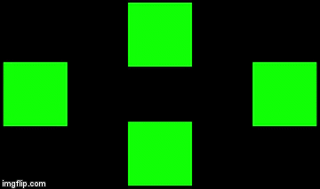

# Flashing Tiles

This is an attempt to implement Flashing Tiles experiment to study "Steady State Visual Potential" using Python.

## How the experiment looks like.


The experiment is implemented using [Kivy](https://github.com/kivy/kivy). Kivy provides `schedule_interval` that is easier
to implement than Pygame which is used by [gumpy-paradigms](https://github.com/gumpy-bci/gumpy-paradigms) 
and also provide faster update rate. Below are error rates of the frequency of each tile. 

```
On Exit Report
Tile with 6.00 hz:
Average Absolute Error: 6.28%
Average FPS: 76.67 fps
Tile with 6.57 hz:
Average Absolute Error: 4.43%
Average FPS: 76.63 fps
Tile with 7.50 hz:
Average Absolute Error: 3.55%
Average FPS: 76.65 fps
Tile with 8.57 hz:
Average Absolute Error: 9.86%
Average FPS: 76.62 fps
```

## Installation

1. use `Python 3.7.2`
2. install `pipenv`
3. install all of dependencies with `pipenv install`
4. enter pipenv environment with `pipenv shell`
5. start the app with `python main.py`
