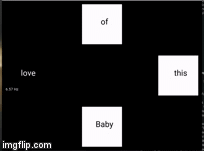

# Flashing Tiles

This is an attempt to implement Flashing Tiles experiment to study "Steady State Visual Potential" using Python. There are 2 associated folders.

1. `pygame/` is implemented using [Pygame](https://github.com/pygame/pygame) as modeled from [gumpy-paradigms](https://github.com/gumpy-bci/gumpy-paradigms) However the update
rate (frame rate) of Pygame is so slow that cause flickering rate too slow as shown in the report as high average error(%).
 
```
On Exit Report
Tile with 6.00 hz:
Average Absolute Error: 66.74%
Average Checking Freqency: 0.10 ms
Tile with 6.57 hz:
Average Absolute Error: 81.91%
Average Checking Freqency: 0.10 ms
Tile with 7.50 hz:
Average Absolute Error: 4.45%
Average Checking Freqency: 0.07 ms
Tile with 8.57 hz:
Average Absolute Error: 19.35%
Average Checking Freqency: 0.07 ms
```

## How the Kivy version experiment look like.


2. `kivy/` is implemented using [Kivy](https://github.com/kivy/kivy). Kivy provides `schedule_interval` that is easier
to implement than Pygame and also provide faster update rate. The error rate is significantly lower.

```
On Exit Report
Tile with 6.00 hz:
Average Absolute Error: 6.28%
Average FPS: 76.67 fps
Tile with 6.57 hz:
Average Absolute Error: 4.43%
Average FPS: 76.63 fps
Tile with 7.50 hz:
Average Absolute Error: 3.55%
Average FPS: 76.65 fps
Tile with 8.57 hz:
Average Absolute Error: 9.86%
Average FPS: 76.62 fps
```
